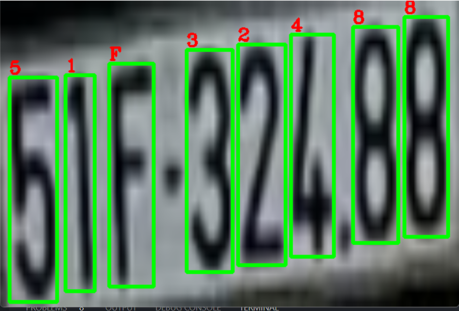
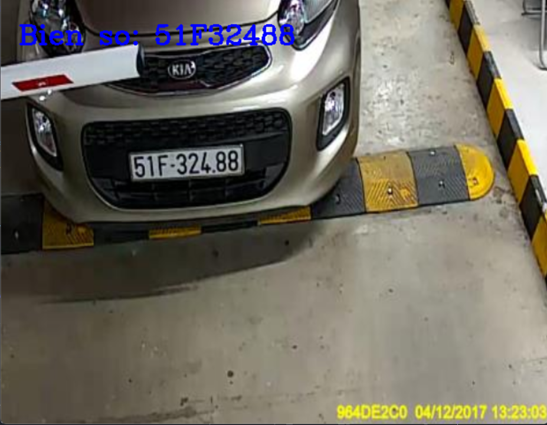

<p align ='center'>

</p>

<h1 align ='center' style = 'color:red;'> <b> NHẬP MÔN THỊ GIÁC MÁY TÍNH </b></h1>

## GIỚI THIỆU MÔN HỌC

* **Tên môn học:** Nhập môn Thị giác máy tính
* **Mã môn học:** CS231
* **Mã lớp:** CS231.M12.KHCL
* **Giảng viên:** Mai Tiến Dũng

## Thành viên

| STT | MSSV       |Họ và tên       | Email                |
| ----|:----------:|----------------|----------------------|
| 1   | 19521622   | Nguyễn Quan Huy|19521622@gm.uit.edu.vn|
| 1   | 19521270   | Trương Quốc Bình|19521270@gm.uit.edu.vn|
| 1   | 19521571   | Nguyễn Hữu Hưng|19521571@gm.uit.edu.vn|

## Thông tin đồ án

* ***Tên đồ án:*** Nhận dạng biển số xe
* ***Công cụ:*** VS Code và Ânconda

## Cài đặt môi trường

Clone repository và tạo môi trường conda `lp_env` sử dụng file `environment.yml`

```
conda env create -f environment.yml
conda activate lp_env
```

## Chạy chương trình

Chạy file `run_.py` theo mẫu ``` python run_.py --image [path_to_image] ```. Trong đó path_to_image là đường dẫn đến hình ảnh.
Ví dụ ``` python run_.py --image .\demo\demodung0.jpg ```


Sau khi chạy file sẽ xuất hiện 2 hình ảnh


